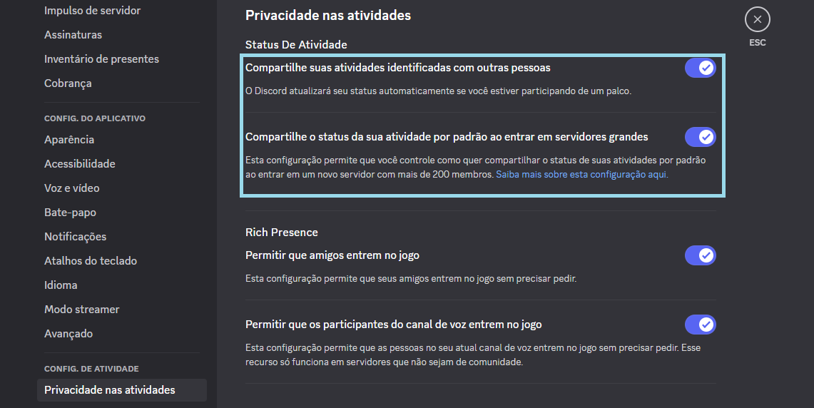
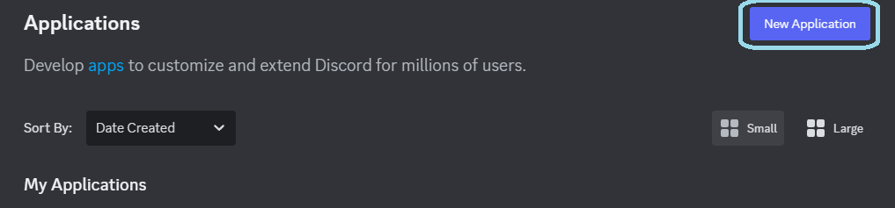
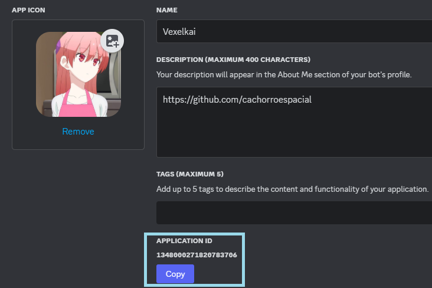

# 🛠️ Setting Up

Antes de configurar, certifique-se de ter o Client do discord instalado, e não do navegador. Também é importante ter habilitado o status de atividade nas configurações do Discord.

<figure><figcaption>
Habilite
</figcaption></figure>

## Configurando o Bot

* Abra o site [RPCT](https://rpct.netlify.app/)
* Clique em **New Application** no canto superior direito.

<figure><figcaption>
NewApplication
</figcaption></figure>

* Escolha o nome do Bot, ele será exibido após "Jogando" no status; clique em Criar.
* Copie o **ID do bot e cole-o no campo Application ID** do RPCT, depois pressione **Start RP**

<figure><figcaption>
Bot ID
</figcaption></figure>

* Se tudo ocorrer bem, seu status no Discord Agora deve ser "Jogando \[Nome-escolhido] ". Se ocorrer erros, olhe o [help.md](help.md "mention") .

&#x20;       O Status não vai ser exibido se você estiver no modo invisível.

* Agora você pode preencher os campos (os botões personalizados, é opcional):

&#x20;   \*  Details : Primeira linha, abaixo do Application ID.

&#x20;   \*  State :  Segunda linha, abaixo da linha Details.

&#x20;   \*  Text of button :  Botão personalizado, com um nome de sua escolha.

&#x20;   \*  URL of button : URL de sua escolha para o Botão personalizado.

&#x20;   \*  Show elapsed time : Esse botão faz motrar o tempo decorrido do Status.

&#x20;   \*  Use custom time : Esse botão faz o tempo decorrido ser de sua escolha.

* O que cada botão faz?

&#x20;   \*  Start RP : Inicia a sua presença personalizada.

&#x20;   \*  Stop RP : Para a sua presença personalizada.

&#x20;   \*  Saves : Mostra as suas configurações salvas e permite criar novas com nomes e ilustrações diferentes.

&#x20;   \*  Settings : Mostra as configurações do programa.

&#x20;        \* Save settings : Salva as configurações atuais do programa.

&#x20;        \* Load settings : Carrega as configurações salvas do programa.

&#x20;        \* Enable start with system : Inicia o programa com o computador.

&#x20;        \* Disable start with system : Desativa a função de iniciar com o computador.

## Notas:

* Se você clicar no **X** para fechar o programa, ele vai ficar em segundo plano, ai para fechar realmente, você clica com o botão direito do mouse no icone, e depois **fechar**
* O programa ainda é novo, e foi feito por apenas uma pessoa(eu), então espere bugs 😉

##

&#x20;     &#x20;

